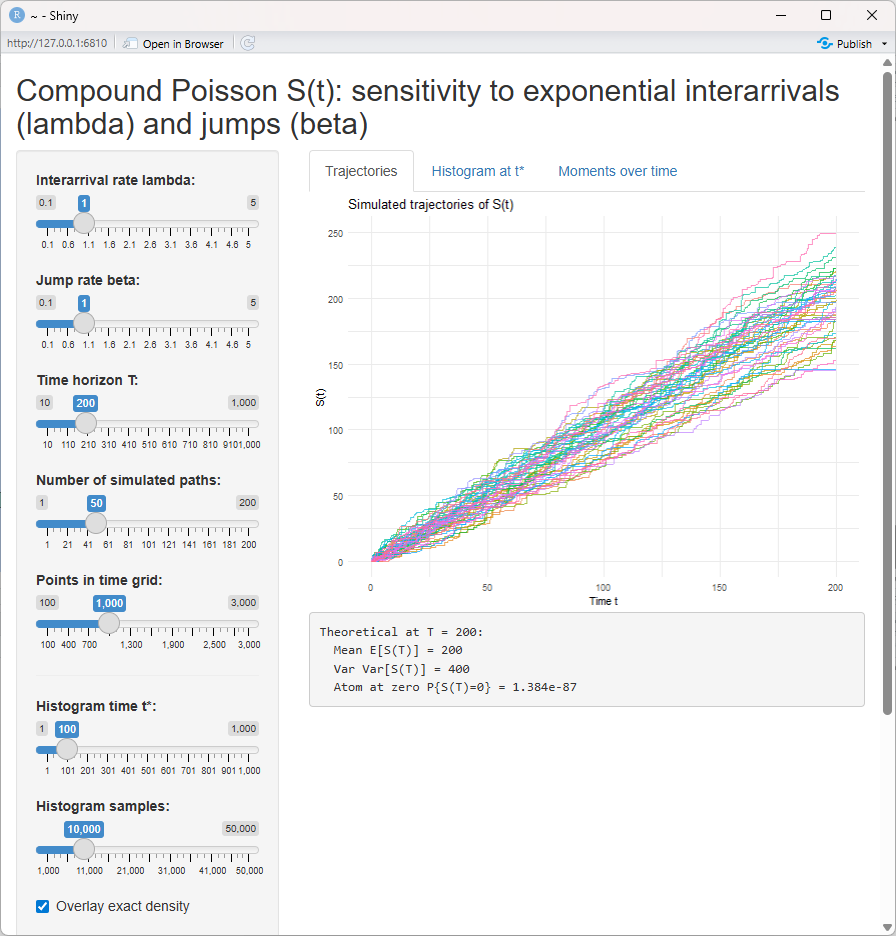

# Compound Poisson Process – R Shiny App

This repository contains a compact implementation and analysis of the compound Poisson process:

S(t) = Σᵢ₌₁ᴺ(t) Xᵢ  
with N(t) following a Poisson process with rate λ, and jump sizes Xᵢ ~ Exp(β).

The project includes:
- A minimal R Shiny app to simulate and visualize S(t)
- Histogram behavior at t = 10, 100, 1000, 10000
- Sensitivity of S(t) to parameters λ and β
- Theoretical expressions exactly as in the assignment report

---

## 📘 Key Mathematical Results  
(from the project report)  
- P(S(t) = 0) = e^(−λt)  
- For x > 0:  
  fₛ(t)(x) = √(λtβ / x) · e^(−λt − βx) · I₁(2√(λtβx))  
- E[S(t)] = (λt)/β  
- Var(S(t)) = (2λt)/(β²)

---

## 📁 Repository Structure
app.R # Shiny application
report/ # Final assignment PDF
plots/ # Histograms and visuals
README.md # Documentation

## ▶ Running the App

Install required packages (`shiny`, `ggplot2`) and run:

shiny::runApp("app.R")

---

## 📄 Report

Full PDF with derivations, plots, and explanations is available in:

`CIA3_ShinyDevelopment_JoyeetaGoswami_2548118.pdf`

---
## 📸 Output

  

## 👩‍🏫 Author  
Joyeeta Goswami  
Christ University – M.Sc. Statistics (2548118)
